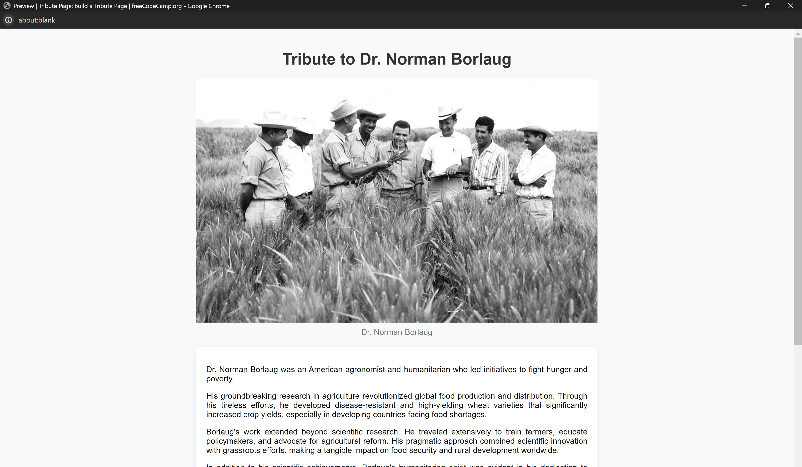

# Tribute Page Project

This repository contains a tribute page project created with FreeCodeCamp. Showcase your HTML/CSS skills by honoring a chosen figure or topic.

# Preview

## Tech Stack

- HTML
- CSS

## Description

This project showcases a tribute page dedicated to Dr. Norman Borlaug, an American agronomist and humanitarian known for his contributions to fighting hunger and poverty.

## Installation Steps

1. Fork this repository
2. Clone your forked copy
    git clone https://github.com/Yashi-Singh-1/Tribute-Page.git
3. Open `index.html` in your browser

## Contributing

Contributions are welcome! Follow these steps:
1. Fork the Project
2. Create your Feature Branch (`git checkout -b feature`)
3. Commit your Changes (`git commit -m 'Add some feature'`)
4. Push to the Branch (`git push origin feature`)
5. Open a Pull Request

## Contact

[Yashi Singh](www.linkedin.com/in/yashi-singh-b4143a246)